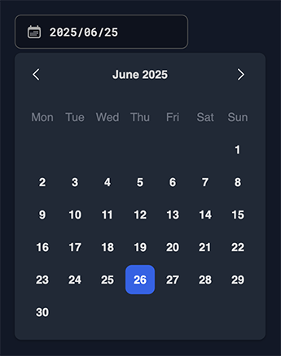

# DateTimePicker Component

A React 19.x date-time picker component, using TypeScript 5.x, styled using native CSS.

`DatePicker`, `DateTimePicker`, `TimePicker` and `DateRangePicker` are distinct components.

✅ tested locally with [yalc](https://github.com/wclr/yalc) on a real project (types, styles, functionality)

✅ tested as a final imported package from NPM on a real project (types, styles, functionality)

✅ tested accessibility for `DatePicker`, `DateTimePicker`, and `TimePicker` components

❌ `DateRangePicker` component is not yet fully tested for accessibility

The package is available on NPM as `@fubar-it-co/date-time-picker`, [go to NPM](https://www.npmjs.com/package/@fubar-it-co/date-time-picker).

A Storybook instance is available to preview the components and their features [here](https://fubaritico-pickers.tiiny.site/?path=/story/datepicker--uncontrolled).

## Dependencies

`@mona-health/react-input-mask` v3.0.3

### Peer Dependencies
- `react` >= 19.0.0
- `react-dom` >= 19.0.0
- `clsx` >= 11.0.0
- `react-transition-group` >= 4.4.5

## Work in progress

Tests have to be written for `DateRangePicker`.

Tests have to be written for the accessibility features.

Some integration tests are still currently performed in real projects.

## Issues

Some work has to be done with peer dependencies.

## Styling

An overall rework of the CSS strategy has been done. The picker is now styled using mere CSS native.

It allows having a better performance and a more consistent styling across the components.

It also facilitates style override and customization.

## Usage

To get the component styles in your project, you can import the CSS file directly in your main entry point (e.g., `index.tsx` or `App.tsx`):

```tsx
import '@fubar-it-co/date-time-picker/styles.css'
```

You can then use the component in your React application like this:

```tsx
import { DateTimePicker } from '@fubar-it-co/date-time-picker';

function App() {
  const handleDateChange = (date?: number) => {
    console.log('Selected date:', date);
  };

  return (
    <div className="App">
      <DateTimePicker
        date={Date.now()}
        onChange={handleDateChange}
        label="Select Date and Time"
        color="blue"
        size="md"
      />
    </div>
  );
}
```

Usage is the same for `DatePicker`, `TimePicker`, and `DateRangePicker` components, with their respective properties.

### Component I18nDateLabel utility

The component provides a utility function to format dates and times based on the selected locale and timezone. You can use it like this:

```tsx
import {DateTimePicker, I18nDateLabel} from '@fubar-it-co/date-time-picker'
import {useState} from "react";

import '@fubar-it-co/date-time-picker/styles.css'
import './App.css'

function App() {
   const [date, setDate] = useState<number | undefined>(new Date('2023-10-01T12:00:00Z').getTime())
   const handleChange = (newDate?: number) => {
      setDate(newDate)
   }

   return (
           <div style={{width: '100vw', height: '100vh', display: 'flex', justifyContent: 'start', alignItems: 'start'}}>
              <DateTimePicker date={date} color="emerald" onChange={handleChange}/>
              <div style={{marginLeft: '20px'}}>
                 <h2>Selected value:</h2>
                 <p>{date ? new Date(date).toString() : 'None'}</p>
                 <I18nDateLabel
                         locale="fr_FR"
                         localeAwareFormat="L LT"
                         value={date}
                 />
              </div>
           </div>
   )
}

export default App
```

It allows displaying the date in a localized format, taking into account the locale and timezone settings.

## Properties

### Common
| Property | Type | Description                         |
|----------|------|-------------------------------------|
| color | `'blue' \| 'red' \| 'green' \| ...` | Tailwind color theme for styling    |
| disabled | `boolean` | Disables the picker input           |
| errors | `string[]` | Error messages displayed below input |
| helperText | `string` | Helper text shown below input       |
| label | `string` | Input label                         |
| labelInfo | `string` | Tooltip information for label       |
| locale | `string` | Language format (ISO-8601)          |
| loading | `boolean` | Shows loading animation             |
| minDate | `number` | Minimum selectable timestamp        |
| maxDate | `number` | Maximum selectable timestamp        |
| required | `boolean` | Marks the field as required         |
| size | `'sm' \| 'md' \| 'lg'` | Component size                      |
| timezone | `Timezone` | Timezone (moment.js based)          |

### Picker-specific Properties
| Property | Type | Description |
|----------|------|-------------|
| enablePortal | `boolean` | Place panel in portal |
| extraIcon | `ReactElement` | Additional right-side icon |
| open | `boolean` | Control panel visibility |
| placement | `'bottom-start' \| 'bottom-end'` | Panel placement |

### DatePicker & DateTimePicker
| Property | Type | Description |
|----------|------|-------------|
| date | `number` | UTC timestamp in ms |
| onChange | `(value?: number) => void` | Date change callback |

### DateRangePicker
| Property | Type | Description |
|----------|------|-------------|
| dateRange | `[number \| undefined, number \| undefined]` | Start/end timestamps |
| onDateRangeChange | `(range: DateRange) => void` | Range change callback |

### TimePicker
| Property | Type | Description |
|----------|------|-------------|
| date | `number` | UTC timestamp in ms |
| onChange | `(value?: number) => void` | Time change callback |

## Color themes

Theme coloring is now implemented. It is based on Tailwind CSS colors. It allows to colorize the pickers according to the tailwind color palettes.

## Features

- **DatePicker**: Select a date from a calendar.
- **DateTimePicker**: Select a date and time from a calendar and time picker.
- **TimePicker**: Select a time from a time picker.
- **DateRangePicker**: Select a range of dates from a calendar.
- **Dark Mode**: Supports dark mode styling for all components.
- **Localization**: Supports multiple locales for internationalization.
- **Timezone**: Supports timezone selection and display.
- **Accessibility**: Fully accessible with ARIA attributes.

## Preview

### DatePicker

<p style="display: flex; gap: 10px; flex-wrap: nowrap; align-items: start; justify-content: left;">
  
  
</p>

### Date Time Picker

<p style="display: flex; gap: 10px; flex-wrap: nowrap; align-items: start; justify-content: left;">
  
  
</p>

### Date Range Picker

<p style="display: flex; gap: 10px; flex-direction: column; align-items: start; justify-content: center;">
  
  
</p>

### Time Picker

<p style="display: flex; gap: 10px; flex-wrap: nowrap; align-items: start; justify-content: left;">
  
</p>

### Color Theme

Note that, by default, the component uses the `blue` color theme. You can change it by passing the `color` prop to the component.

<p style="display: flex; gap: 10px; flex-wrap: nowrap; align-items: start; justify-content: left;">
  
</p>

## Development

Components in this project are visible in a storybook instance and a vite dev server.

### Setup

1. Clone the repository
2. Install dependencies:
   ```bash
   npm install
   # or
   yarn
   # or
   pnpm install
   ```

### Storybook

Run the storybook instance to preview the components:

```bash
npm run storybook
# or
yarn storybook
# or
pnpm storybook
```

### Development Server

Run the development server to preview the components:

```bash
npm run dev
# or
yarn dev
# or
pnpm dev
```

This will start a development server at http://localhost:3000 with a preview of the component.

### Testing

Run the tests:

```bash
npm test
# or
yarn test
# or
pnpm test
```

### Linting and Formatting

The project uses ESLint 9.x for linting and Prettier 3.x for code formatting.

Run the linter:

```bash
npm run lint
# or
yarn lint
# or
pnpm lint
```

Fix linting issues automatically:

```bash
npm run lint:fix
# or
yarn lint:fix
# or
pnpm lint:fix
```

Format code with Prettier:

```bash
npm run format
# or
yarn format
# or
pnpm format
```

### Building

Build the component for production:

```bash
npm run build
# or
yarn build
# or
pnpm build
```

## Change logs

After each release, a changelog is generated automatically. You can find the changelog in the `CHANGELOG.md` file.
Don't forget to run `chmod +x change-log.sh` to make the file executable

## Publishing

To publish the package to npm, you can use the following command:

```bash
./publish.sh # Don't forget to run chmod +x publish.sh to make the file executable
```

The script accepts the following parameters:

```bash
./publish.sh patch # or minor or major
```

where `patch`, `minor`, or `major` can be used to specify the version bump type according to [Semantic Versioning](https://semver.org/).

### Setup Requirements

Before you can publish, make sure:

1. You have a npm account and are logged in
2. You have added an NPM_TOKEN secret to your GitHub repository:
   - Generate a token from your npm account settings
   - Go to your GitHub repository settings → Secrets → Actions
   - Add a new secret named NPM_TOKEN with your npm token value

## Local Development with Yalc

To test the package locally before publishing to npm, you can use `yalc`. This allows you to simulate installing and using the package in other local projects.

### Setup Yalc

1. Install yalc globally:
   ```bash
   pnpm add -g yalc
   ```
   Note: If you encounter any global installation issues, run `pnpm setup` first.

### Publishing Locally

In the date-time-picker directory:

1. Build and publish to a local 'yalc' store:
   ```bash
   pnpm build
   yalc publish
   ```

## Using in Another Project

In your test project directory:

1. Add the package from yalc:
   ```bash
   yalc add @<fubar-it-co or your scope>/date-time-picker
   pnpm install
   ```

2. Import and use the component as if it were installed from npm:
   ```typescript
   import { DateTimePicker } from '@<fubar-it-co or your scope>/date-time-picker';
   ```

### Development Workflow

For active development:

1. In the date-time-picker directory, use watch mode to automatically update changes:
   ```bash
   pnpm build --watch
   ```

2. In another terminal, push changes to linked projects:
   ```bash
   yalc push
   ```

   Or use `yalc push --watch` to automatically push changes.

### Cleanup

When you're done testing:

1. In your test project:
   ```bash
   yalc remove @<fubar-it-co or your scope>/date-time-picker
   pnpm install
   ```

2. Optional - remove all yalc links globally:
   ```bash
   yalc installations clean
   ```

## NPM Token Configuration

When working with private packages or publishing, you might encounter issues with the NPM_TOKEN. Here's how to handle it:

### For Local Development

If you see warnings about NPM_TOKEN not being set, you have two options:

1. **Simple Solution (Recommended for Local Development)**
   - Delete the `.npmrc` file locally (it's gitignored anyway)
   - Or create a basic `.npmrc` with just:
     ```
     registry=https://registry.npmjs.org/
     ```

2. **For Publishing and CI/CD**
   - Create a `.npmrc` file with:
     ```
     //registry.npmjs.org/:_authToken=${NPM_TOKEN}
     registry=https://registry.npmjs.org/
     ```
   - Set the NPM_TOKEN in your environment:
     ```bash
     export NPM_TOKEN=your_token_value
     ```

Note: The `.npmrc` file is git-ignored for security reasons. For local development, you typically don't need the NPM_TOKEN unless you're publishing or accessing private packages.

## License

MIT
